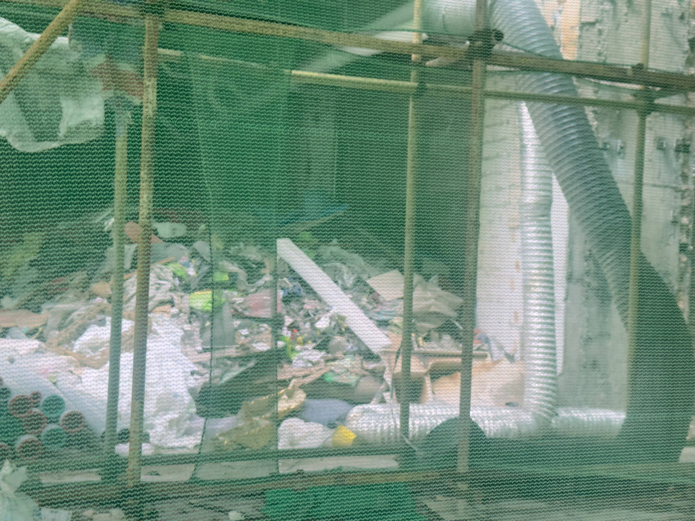

# Nadar Photo Gallery

A minimalist photo gallery website showcasing photography with a clean, modern design. Features an immersive entry page, multiple view modes, and smooth animations.

## 📁 Project Structure

```
nadarlaugallery-main/
├── assets/
│   ├── Audio/
│   │   └── All you are going to want to do is get back there.mp3
│   └── images/
│       ├── P:001.jpg
│       ├── P:002.jpg
│       ├── P:003.jpg
│       └── ... (P:004 to P:015)
├── index.html              # Main HTML file
├── script.js               # JavaScript functionality
├── styles.css              # CSS styles and themes
├── reset-intro.html        # Utility page to reset intro page
└── README.md               # This file
```

## 🛠️ Technology Stack

### Core Technologies
- **HTML5** - Semantic markup and structure
- **CSS3** - Styling with CSS Variables, Flexbox, Grid, and animations
- **Vanilla JavaScript (ES6+)** - No frameworks or dependencies

### Key Features & Techniques
- **CSS Custom Properties (Variables)** - For theming and consistent design tokens
- **FLIP Animation** - Smooth transitions between view modes
- **Intersection Observer API** - Lazy loading and performance optimization
- **LocalStorage API** - User preferences persistence (theme, view mode, intro status)
- **CSS Grid & Flexbox** - Responsive layouts
- **CSS Clip-path** - Image reveal animations
- **SVG Icons** - Theme toggle icons

### Browser APIs Used
- `IntersectionObserver` - Lazy image loading
- `localStorage` - User preferences
- `requestAnimationFrame` - Smooth animations
- `ResizeObserver` - Dynamic skeleton sizing
- `prefers-reduced-motion` - Accessibility support

## ✨ Features

### Entry Page
- **Introductory Text** - Three-paragraph narrative with fade-in animation
- **Ripple Transition** - Smooth circle reveal animation when entering gallery
- **Audio Integration** - Background music with 5-second fade-in on entry
- **One-time Display** - Shown only on first visit (can be reset)

### Gallery Views
- **Grid Mode** - Responsive grid layout (5 columns desktop, 3 tablet, 2 mobile)
- **List Mode** - Horizontal list with image metadata (P:001 format, dimensions, year)
- **Feed Mode** - Single-column vertical feed layout
- **FLIP Animations** - Smooth transitions between view modes
- **View Persistence** - Remembers user's preferred view mode

### Lightbox Viewer
- **Full-screen Image View** - Click any image to open lightbox
- **Keyboard Navigation** - Arrow keys, Escape to close
- **Touch Swipe** - Swipe left/right on mobile devices
- **Thumbnail Strip** - Centered thumbnail navigation at bottom
- **Image Numbering** - Displays P:001 format in lightbox
- **Smooth Transitions** - Slide animations when switching images
- **FLIP Animation** - Zoom from thumbnail to fullscreen

### Theme System
- **Dark Mode** - Complete dark theme support
- **Theme Toggle** - Sun/moon icon button in header
- **Persistent Preference** - Theme choice saved in localStorage
- **CSS Variables** - Dynamic color switching via CSS custom properties
- **Smooth Transitions** - Theme changes animate smoothly

### Image Loading & Performance
- **Lazy Loading** - Images load as they enter viewport
- **Skeleton Loading** - Grayscale placeholders with breathing animation
- **Progressive Reveal** - Images reveal from top to bottom with clip-path
- **Concurrent Loading** - Up to 4 images load simultaneously
- **Priority Loading** - First 3 viewport images load immediately
- **Color-matched Skeletons** - Skeleton color matches image dominant color

### Accessibility
- **ARIA Labels** - Proper semantic markup
- **Keyboard Navigation** - Full keyboard support
- **Focus Indicators** - Visible focus rings
- **Reduced Motion** - Respects `prefers-reduced-motion` preference
- **Screen Reader Support** - Proper alt text and ARIA attributes

## 🚀 Local Development

### Quick Start
Simply open `index.html` in a browser, or run a local server:

```bash
# Using Python 3
python3 -m http.server 8080

# Using PHP
php -S localhost:8080

# Using Node.js (http-server)
npx http-server -p 8080
```

Then visit `http://localhost:8080`

### Viewing the Entry Page
The entry page is shown only on first visit. To view it again:

1. **URL Parameter** (Recommended):
   ```
   http://localhost:8080/index.html?showIntro=true
   ```

2. **Reset Utility**:
   Open `reset-intro.html` in browser and click the reset button

3. **Manual Reset**:
   Open browser console (F12) and run:
   ```javascript
   localStorage.removeItem('introShown');
   ```
   Then refresh the page.

## 📝 Adding Photos

1. Place your images in `assets/images/` directory
2. Name them using the format: `P:001.jpg`, `P:002.jpg`, etc.
3. Update the `` tags in `index.html`:
   ```html
   
   ```
4. Update the `figcaption` with image metadata:
   ```html
   <figcaption>
     <span class="item-number">P:001</span>
     <span class="item-size">1080 × 1440</span>
     <span class="item-year">2025</span>
   </figcaption>
   ```

## 🎨 Customization

### Theme Colors
Edit CSS variables in `styles.css`:

```css
:root {
  --bg-color: #fff;
  --text-color: #111;
  --text-color-secondary: rgb(153, 153, 153);
  /* ... */
}

[data-theme="dark"] {
  --bg-color: #111;
  --text-color: #fff;
  /* ... */
}
```

### View Mode Gaps
Adjust spacing in CSS variables:

```css
--gap-grid-desktop: 2rem;
--gap-grid-tablet: 1.5rem;
--gap-grid-mobile: 1rem;
--gap-list: 1.2rem;
--gap-feed: 16px;
```

### Audio Settings
Modify audio fade-in in `script.js`:

```javascript
fadeInAudio(5000, 0.6); // duration: 5000ms, target volume: 60%
```

## 📦 Deployment

This is a static site and can be deployed to any static hosting service:

- **Vercel** - `vercel deploy`
- **Netlify** - Drag and drop or Git integration
- **GitHub Pages** - Enable in repository settings
- **Cloudflare Pages** - Connect repository
- **Any static host** - Upload all files

No build process required - just upload the files!

## 🔧 Browser Support

- Chrome/Edge (latest)
- Firefox (latest)
- Safari (latest)
- Mobile browsers (iOS Safari, Chrome Mobile)

## 📄 License

MIT

## 🎯 Key Code Sections

### Theme Toggle (`script.js`)
```javascript
// Theme toggle handler
themeToggle.addEventListener('click', () => {
  const currentTheme = htmlElement.getAttribute('data-theme');
  const newTheme = currentTheme === 'dark' ? 'light' : 'dark';
  htmlElement.setAttribute('data-theme', newTheme);
  localStorage.setItem('theme', newTheme);
});
```

### FLIP Animation (`script.js`)
```javascript
// FLIP: First, Last, Invert, Play
const firstRects = items.map(item => item.getBoundingClientRect());
// ... change layout ...
const lastRects = items.map(item => item.getBoundingClientRect());
// ... animate transition ...
```

### Lazy Loading (`script.js`)
```javascript
const intersectionObserver = new IntersectionObserver((entries) => {
  entries.forEach(entry => {
    if (entry.isIntersecting) {
      // Load image
    }
  });
}, { threshold: 0.1, rootMargin: '50px' });
```

---

Built with ❤️ using vanilla web technologies.
